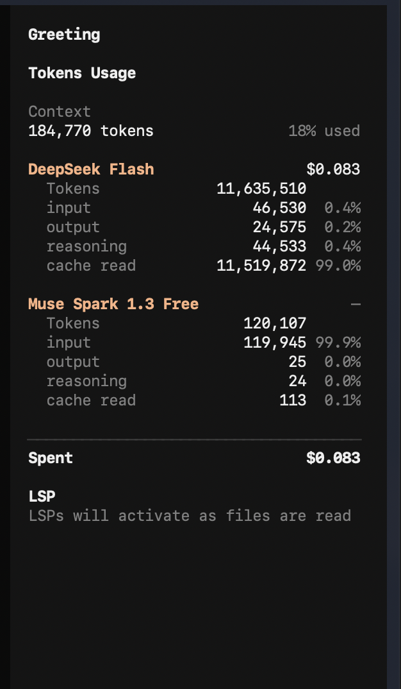

# opencode-usage-plugin

A sidebar panel for the [opencode](https://opencode.ai) TUI that breaks a
session down by model: how many tokens each one consumed and what it cost.

<p align="center">
  
</p>

The `Context` block mirrors opencode's built-in panel — the token count and
share of the context window for the latest assistant turn — but leaves out its
cost, which does not account for peak pricing.

Each model gets a header row with its estimated cost, then the `input`
(cache miss), `output`, `reasoning`, and `cache read` (cache hit) counters
summed over the session. The percentage on each row is that counter's share of
the model's own total tokens.

## Requirements

- opencode `>= 1.18.0`

The plugin is a TUI plugin: it imports from `@opencode-ai/plugin/tui` and renders
into the `sidebar_content` slot at order `100`, the same slot the built-in
context panel uses.

## Install

### From npm

opencode installs npm plugins on startup, so you only need to list it. Add the
package to `tui.json`:

```jsonc
{
  "$schema": "https://opencode.ai/tui.json",
  "plugin": ["opencode-usage-plugin"]
}
```

Or let the CLI do it: `opencode plugin opencode-usage-plugin --global`.

### From a local checkout

There's no need to copy the file into a plugin directory. Point `tui.json`
straight at the source with an absolute path (or a `file://` URL):

```jsonc
{
  "$schema": "https://opencode.ai/tui.json",
  "plugin": ["/Users/you/opencode-usage-plugin/src/index.tsx"]
}
```

### Disable the built-in panel

The plugin renders into the same slot as opencode's built-in context panel, so
turn that one off to avoid stacking:

```jsonc
{
  "plugin_enabled": {
    "internal:sidebar-context": false
  }
}
```

## Pricing

Cost is computed per message from a rate table, so peak/off-peak pricing is
honoured using each message's own timestamp. Models without a configured rate
table fall back to the `cost` opencode records, which is priced automatically
from [models.dev](https://models.dev) (free tiers show `—`).

### Rate tables

Prices are US dollars per million tokens. `input` is cache-miss input,
`cacheRead` is cache-hit input, and `output` also covers `reasoning` unless a
separate `reasoning` rate is given.

```jsonc
{
  "plugin": [
    [
      "opencode-usage-plugin",
      {
        "pricing": {
          "deepseek-flash": {
            "input": 0.15,
            "output": 0.6,
            "cacheRead": 0.003,
            "peak": {
              "input": 0.3,
              "output": 1.2,
              "cacheRead": 0.006
            }
          }
        }
      }
    ]
  ]
}
```

Keys can be a bare `modelID` or `providerID/modelID`. Top-level rates apply
outside peak windows; the optional `peak` block replaces them inside peak
windows. A model without `peak` has flat pricing.

### Peak windows

`peakHours` lists the UTC intervals where `peak` rates apply. Windows may wrap
past midnight, and `days` restricts them to weekdays (`mon`..`sun`, JS-style
`0`..`6` also accepted; omit for every day). DeepSeek's schedule — weekdays
`01:00-04:00` and `06:00-10:00` UTC — is:

```jsonc
{
  "peakHours": [
    { "start": "01:00", "end": "04:00", "days": ["mon", "tue", "wed", "thu", "fri"] },
    { "start": "06:00", "end": "10:00", "days": ["mon", "tue", "wed", "thu", "fri"] }
  ]
}
```

The extra cost paid for peak messages is shown under `Spent`.

## License

MIT — see [LICENSE](LICENSE).
